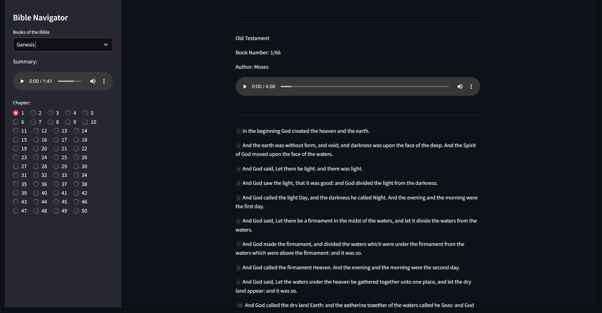

# Streamlit King James Bible App with Narration

### Introduction

This repository contains code for generating audio from text using Azure Cognitive Services' Text-to-Speech (TTS) API. The project utilizes Python for the TTS logic and OpenTofu for provisioning the required Azure resources.

<div align="center">

</div>

### Prerequisites

- Azure Subscription
- OpenTofu installed and configured
- Python installed on your local machine
- `Azure` CLI configured

### Getting Started

Clone the repository and move into the appropriate directory:

```bash
git clone https://github.com/TheCloudStead/streamlit-kjb
cd streamlit-kjb/
pip3 install -r requirements.txt
streamlit run app.py
```

### Deploying Infrastructure for Audio Generation
Move to the OpenTofu configuration directory:

```bash
cd sample/
```

Before deploying, make sure to update the necessary variables in `variables.tf` to match your project configuration.

1. **Format the Configuration Files**:
   ```bash
   tofu fmt
   ```

2. **Initialize the Project**:
   ```bash
   tofu init
   ```

3. **Apply the Configuration**:
   ```bash
   tofu apply
   ```
4. **Export Config**:
   ```bash
   tofu output -json key > config.json
   ```

   This command will deploy the necessary infrastructure, including Azure Cognitive Services for TTS.

### Files Overview

- **main.py**: The core Python script for generating audio files from text.
- **requirements.txt**: Lists Python dependencies required for the project.
- **variables.tf**: Contains configuration variables for OpenTofu, such as Azure subscription details and resource settings.
- **main.tf**: Contains OpenTofu script for deploying the infrastructure.

### Generating Audio

Run the Python script to generate audio files for the Bible chapters:

```bash
pip3 install -r requirements.txt
python3 main.py
```

Audio files will be saved in the `audio-files/` directory.

### Tips

- Ensure you have correct permissions set for provisioning Azure resources and using Text-to-Speech APIs.
- Test your Python script locally before generating audio files for large datasets.
- Keep your `variables.tf` file updated to match your Azure project settings.

### License

This project is licensed under the MIT License. See the `LICENSE` file for more details.

### Acknowledgments

Thank you to the readers of my Medium articles!